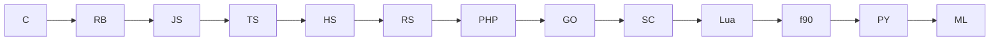

## Returns
- `main.c`: +1 if stack increases else -1
- `main.rb`: Floor(abs(cos x + sin x)), low effort :)
- `main.js`: Gaussian filter on 3x3 with n in the middle
- `main.ts`: Gaussian filter on 3x3 with n in the middle with initial values
- `main.hs`: Calculate schwarzschild radius for `:int+:` for n solar masses
- `main.rs`: Some Elliptic curve value from `./a.out :float:`
- `main.php`: Calculate entropy of a string for `:string:`
- `main.go`: approx Gamma function for `:real+:`
- `main.sc`: Count #iters to find a float in 0-1 using binary search
- `main.lua`: Convert to base 7
- `main.f90`: 1 for "prime" or 2 for "composite" for `./a.out :int+:`
- `main.py`: Calculate energy for QHM at nth level for `:[1-5]:`
- `main.ml`: Golden ratio from fib series from seeds `:float:`

## Types

| Lang | In Type | Out Type |
| ---- | ------- | -------- |
| C    | void    | int      |
| Ruby   | int     | int      |
| Javascript   | int     | int      |
| Typescript   | int     | int      |
| Haskell   | int     | float    |
| Rust   | float   | float    |
| PHP  | string/float | float |
| Gi   | float   | float    |
| Scala   | float   | int      |
| Fortran  | int     | string   |
| Python   | int     | float    |
| OCaml | float   | float    |